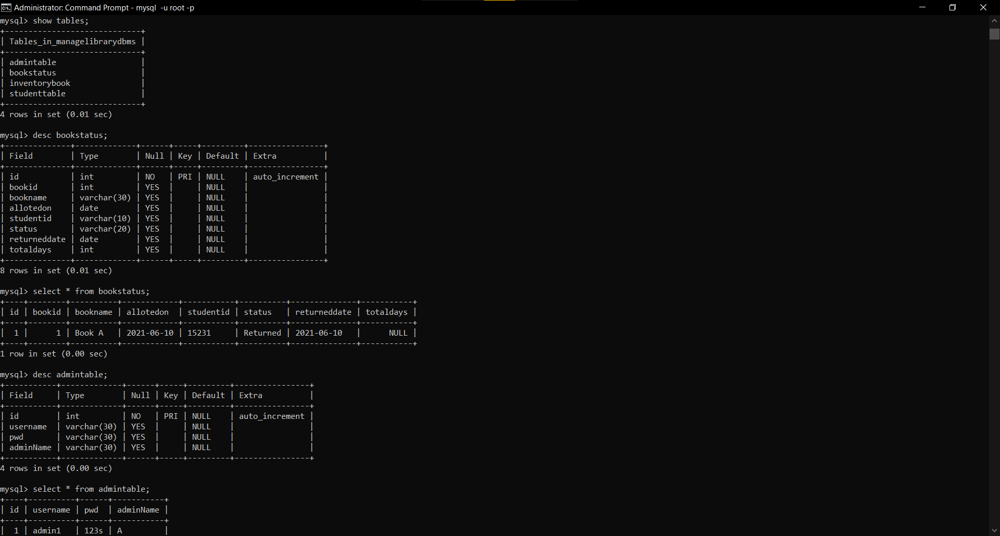
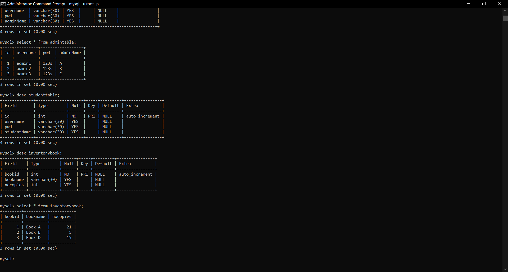

# vthz-library-management-DBMS-FLASK
Small management based project using Python Flask and MySql

Features:
1)Login for Student and Admin
2)Admin can add new books,student and other admins.
3)Admin can remove books,students and other admins.
4)Admin can Allot a book,return a book and check status of all books.
5)Students can check what books they have taken from the begining.
6)Inventory is also available so that they can see which books are availabel in the library.

SQL TABLE Samples

